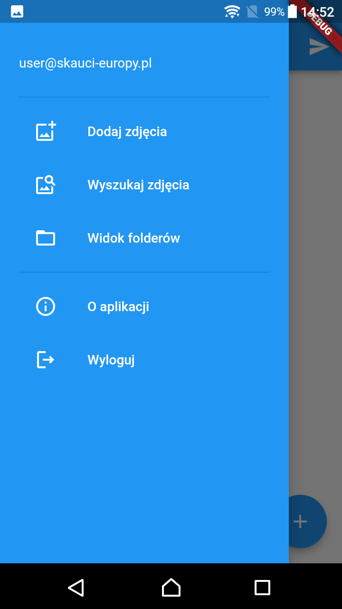
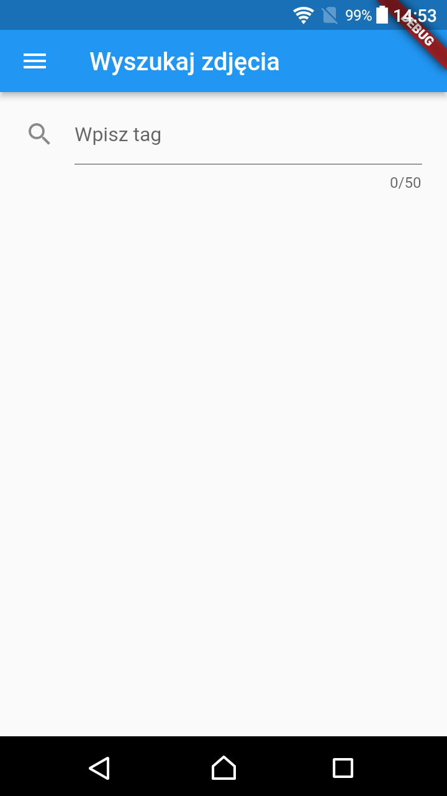

# Photo Tagger App

An application was created that works on the Android system. It allows you to add photos, tag them, send them to the server, download them from the server and save them on your own device.

## Integration
The application connects to the server via the Firebase service, which defines the API through which the application connects to services.

## Requirements
Android operating system with API level no lower than 19. consent to save, read data by the application and the possibility of vibration.

## User instructions
You can log in to the application only using an e-mail address in the @skaci-europy.pl domain and the correct password. Each time the application is launched, a new login to the application is required. After logging in, the user sees the default view for adding photos. This action will be used most often.
In the view for adding photos, you can upload one or more photos. 

After clicking on the photo, you can set its tags. 

The explicitly required tags are the author of the photo and the date the photo was created. Tags are saved only after pressing the Confirm button. The status of successful tagging of the photo is visible in the form of a border around the photo. 

After successfully tagging the photos, you can send them by clicking the send button in the upper right corner. After this operation, you must wait patiently until the next screen. The sending effect will be displayed after the operation is completed. It is possible to switch between the other screens (while still logged in) without losing the tagging progress.

In the second view, you can search for any phrase longer than 2 that is associated with the photo. The photo can be downloaded by long-pressing it.

In the third view, you can view the physical structure of the database storing the photos. After clicking on the folder, you go to this folder, and after clicking on the photo, you can take a closer look at it.

The fourth view contains information about the application.

The fifth view is the login screen.

## Remarks

This project was part of Flutter course on Faculcy of Matematics and Information Science on Warsaw University of Technology